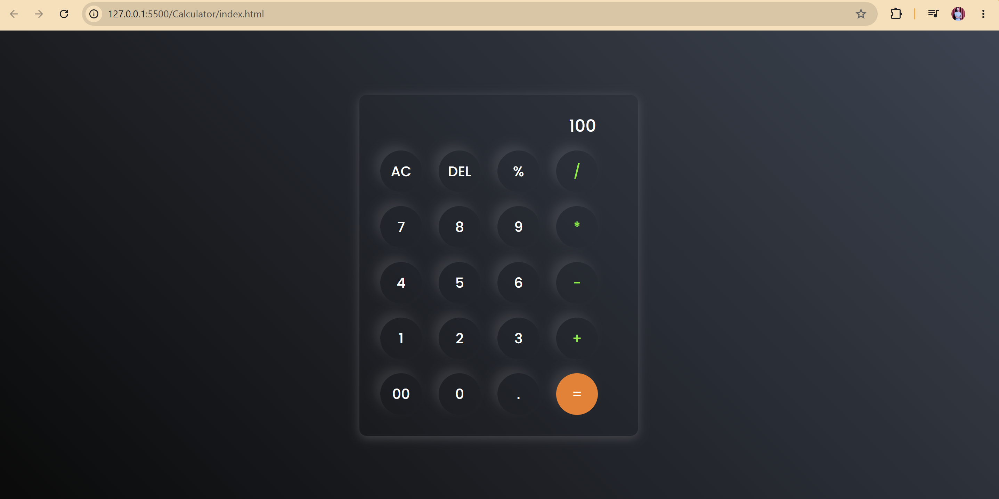
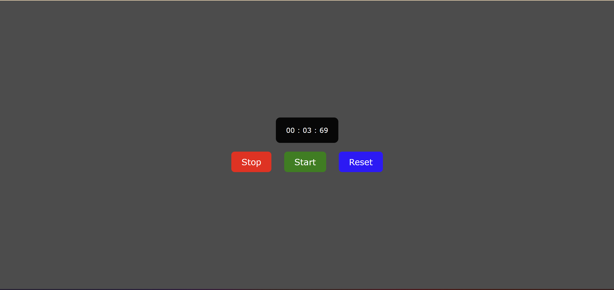

# JavaScript Projects

This repository contains small, self-contained JavaScript projects built with HTML, CSS, and vanilla JavaScript. Each project has its own folder with an `index.html` you can open in a browser.

Contents

- `Calculator/` — A simple calculator (addition, subtraction, multiplication, division).
- `Password Generator/` — A configurable password generator with length slider and character-type options.
- `Analog Clock/` — A styled analog clock with hour, minute, and second hands.
- `QR-Code Generator/` — A QR code generator for text or URLs.
- `CountDown Timer/` — A countdown timer with start, pause, and reset controls.
- `Form Validation/` — A form validation example with input checks and error messages.
- `StopWatch/` — A stopwatch with start, stop, and reset controls.

How to run

1. Open the project folder you want to try (for example `Calculator/` or `Password Generator/`).
2. Open the `index.html` file in a browser (double-click or use your editor's Live Preview).

Projects

## Calculator

Simple calculator UI and behavior. Open [Calculator/index.html](Calculator/index.html) to run it locally.

Example output:

## Password Generator

Configurable password generator with checkboxes for lowercase, uppercase, numbers, and symbols plus a length slider. Open [Password Generator/index.html](Password%20Generator/index.html) to run it locally.

Example output:

## Analog Clock

A styled analog clock with hour, minute, and second hands. Open [Analog Clock/index.html](Analog%20Clock/index.html) to run it locally.

Features:

- Hour, minute, and second hands with smooth updates.
- Numbered hour marks around the dial.

Example output:
This is a sample output of the source code.

## CountDown Timer

A countdown timer with start, pause, and reset controls. Open [CountDown Timer/index.html](CountDown%20Timer/index.html) to run it locally.

Example output:

## Form Validation

A form validation demo with required field checks and inline error messages. Open [Form Validation/index.html](Form%20Validation/index.html) to run it locally.

Example output:

## StopWatch

A stopwatch with start, stop, and reset controls. Open [StopWatch/index.html](StopWatch/index.html) to run it locally.

Example output:
This is the sample ouptut of the StopWatch Project.

## QR-Code Generator

A QR code generator for text or URLs. Open [QR-Code Generator/index.html](QR-Code%20Generator/index.html) to run it locally.

Example output:

Notes

- If a checkbox is not selected in the Password Generator, that character type will be omitted from the generated password.
- Both apps are intentionally small and dependency-free.

The root `Output.png` file shows a sample output for the repository and can be opened from the project root.

If you want me to add live preview instructions or a short demo GIF instead of SVGs, tell me which format you prefer and I can update the README.
